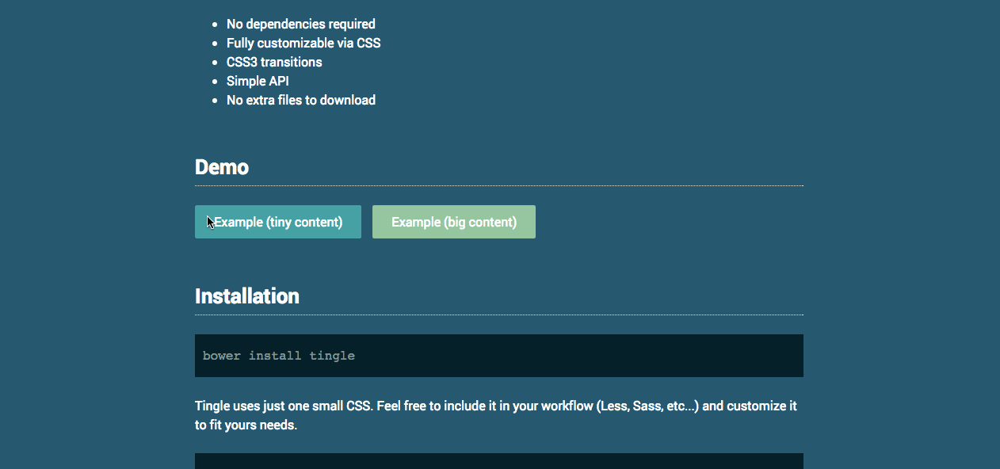

Read the documentation: [https://robinparisi.github.io/tingle/](https://robinparisi.github.io/tingle/)

Tingle is a minimalist and easy-to-use modal plugin written in pure JavaScript:

* No dependencies required
* Fully customizable via CSS
* CSS transitions
* Simple API
* No extra files to download
* Created with UX in mind

## License

Copyright (c) 2016 [robinparisi](https://github.com/robinparisi)

This content is released under the [MIT License](http://opensource.org/licenses/MIT).
